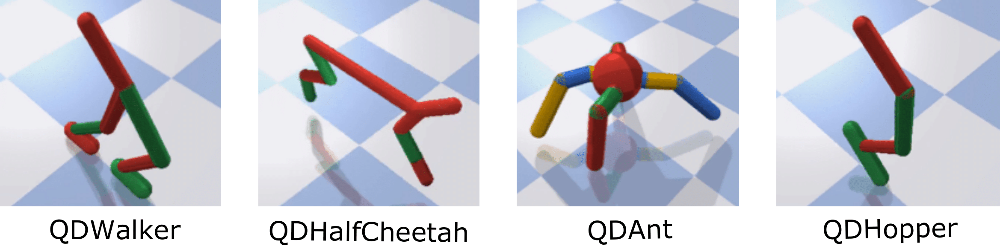

# Overview

QDgym proposes a suite of tasks for Quality-Diversity (QD) optimisation. It has been originally introduced in the [PGA-MAP-Elites](https://github.com/ollenilsson19/PGA-MAP-Elites) paper and is built on [OpenAI Gym](https://github.com/openai/gym) in [PyBullet](https://github.com/bulletphysics/bullet3.git).

This repository extends the original [QDgym benchmarks repository](https://github.com/ollenilsson19/QDgym.git) with a deterministic version of each task: QDDeterministicWalker2DBulletEnv-v0, QDDeterministicHalfCheetahBulletEnv-v0, QDDeterministicAntBulletEnv-v0, QDDeterministicHopperBulletEnv-v0 and QDDeterministicHumanoidBulletEnv-v0.
In the original QDgym tasks, as in the initial OpenAI Gym definition, the initial joint-positions of all robots are sampled from a Gaussian distribution, making these tasks stochastic.
In the Deterministic QDgym tasks we propose to set these initial positions to 0.


# Tasks

This repository includes 10 tasks: 5 stochastic tasks and 5 deterministic ones. In all of them, a robot aims to discover all the ways it can walk while maximising a trade-off between speed and energy consumption. 

<p align="center">

</p>

The details of the state, action, fitness and BD given below are the same for the stochastic and deterministic versions of each task. 

+ State: The robot's current height, x, y and z velocity, roll, pitch and yaw angles of the centre of gravity and position of the joints.
    + QDWalker: 22 dimensions
    + QDHalfCheetah: 26 dimensions
    + QDAnt: 28 dimensions
    + QDHopper: 15 dimensions
    + QDHumanoid: 44 dimensions
+ Action: Continuous-valued torques applied in each robot joints.
    + QDWalker: 6 dimensions
    + QDHalfCheetah: 6 dimensions
    + QDAnt: 8 dimensions
    + QDHopper: 3 dimensions
    + QDHumanoid: 17 dimensions
+ Fitness: In all tasks, the fitness is defined as in the original Gym tasks, as the accumulated forward progress made over the lifespan of the simulation (1000 steps) with an energy usage penalty and a reward for surviving each time-step of the simulation.
+ Behavioural Descriptor: The time proportion each foot of the robot is in contact with the ground (scaled to range from 0 to 1).
    + QDWalker: 2 dimensions
    + QDHalfCheetah: 2 dimensions
    + QDAnt: 4 dimensions
    + QDHopper: 1 dimension
    + QDHumanoid: 2 dimensions


# Installation and Use

You can install the QDgym_extended package using pip by executing the following command:

```
pip3 install git+https://github.com/adaptive-intelligent-robotics/QDgym_extended.git#egg=QDgym_extended
```

The interface of the tasks is similar to those of other [Gym tasks](http://arxiv.org/abs/1606.01540). We give below a simple example for QDDeterministicWalker2DBulletEnv-v0, to switch to any other QDgym environment you would just need to change the name when creating the Gym environment.

``` python
# Imports
import gym
import QDgym_extended

# Make environment
env = gym.make("QDDeterministicWalker2DBulletEnv-v0")

# Reset environment
state = env.reset()
done = False

# Evaluation loop
while not done: 
    action = env.action_space.sample() # Sampling some random action
    state, reward, done, info = env.step(action) 

# Get final fitness and BD
fitness = env.tot_reward
behaviour_descriptor = env.desc # alternatively behaviour_descriptor = info["bc"] for compatability with the code released for MAP-Elites-ES

# Close environment
env.close()
```
